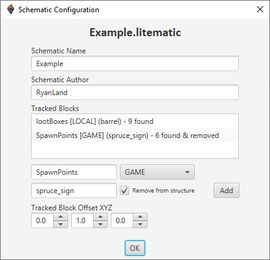

# DFSchematics v1.5.0
Tool to import schematic files into DiamondFire.

You can use this application to convert schematic files to 
DiamondFire data templates, which can then be imported into
a plot using a builder function.  
This is useful for e.g. importing maps from the internet, saving plot space, and for games with rotating
(destructible) maps. This is the successor to Schem2DF.

_I do not take responsibility for the ownership/copyright of any builds imported through this program._

## Install

To install the application, go to the [releases page](https://github.com/RyanLandDev/DFSchematics/releases) and download the executable file from the latest version.

## How to use

1. Launch Minecraft with either [recode](https://github.com/homchom/recode) or [CodeClient](https://github.com/DFOnline/CodeClient) installed.
2. Navigate to a plot in dev mode.
3. Open the program, click _'Pick file...'_ and choose a schematic file (`.schem` `.litematic` `.schematic`)*.
4. (Optional) [Configure the schematic.](#schematic-configuration)
5. Send the generated schematic data template(s) to Minecraft and place them in order.
6. Send the builder template to Minecraft and place it.
7. Call the builder function and configure the chest parameters.

_*At the moment, only Sponge, Litematica and Schematica schematics are compatible, although additional formats may be supported in the future.
If you have a different format, please convert it to a valid format beforehand._

## Schematic configuration

You can customize the output template using the Schematic Configuration tab,
accessed by clicking _'Configure schematic...'_.

The schematic name is used for the function name.  
Both the schematic name and author will be placed inside the `Metadata` list.

### Tracked blocks

A tracked block is a type of block that will be looked for in the schematic.
All instances of the block's locations will be put into a list variable.  
- This is useful for automatically generating a list of e.g. team spawnpoints, loot boxes, power-ups, etc.
- The generated tracked block lists will be completely ignored by the schematic builder, it is up to you to use the lists.
- The _Remove from structure_ option will replace all block instances with air when enabled.
For example, if you have gold blocks representing spawn points, this feature will remove those unwanted blocks automatically.
- The configured _Tracked Block Offset XYZ_ coordinates will be added to every found location.

**NOTE:** All generated locations ignore the schematic origin location.
To circumvent this, either add the origin location when using locations or use the _Tracked Block Offset XYZ_ feature.

## Support

If you need help using the program, you can contact me on Discord at `ryandev.`.

## Suggestions/Bugs

Do you have a suggestion or have you found a bug? Please [open an issue](https://github.com/RyanLandDev/DFSchematics/issues/new)
or contact me on Discord at `ryandev.`.

## Dependencies

The program reads schematic files using [schematic4j](https://github.com/SandroHc/schematic4j).